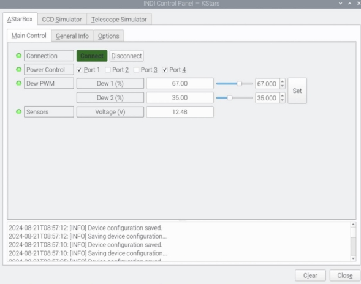
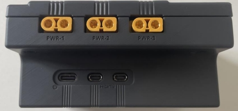
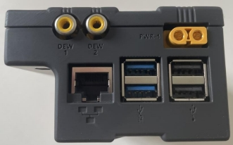
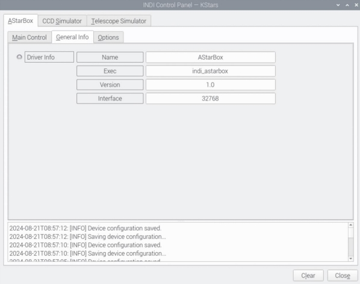
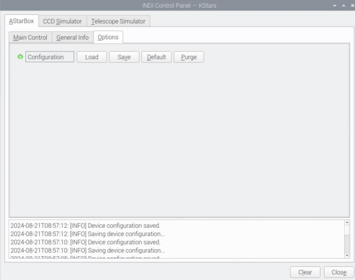

**Pre-requisite:**  Please ensure that the I2C interface is enabled on your AStarBox  
before starting the AStarBox Indi driver – see the AStarBox software installation  
guide for more information. The driver will not run if the box is solely powered via the  
USB-C socket on the Pi – it requires 12V input.

## Main Control Panel

Once started, the AStarBox controls will be shown on the “Main Control” tab.

The AStarBox power controls are simple:

-   **Connection**: will connect or disconnect the box from the driver.
-   **Power Control:** Power to each port is controlled by ticking the relevant box. The port numbers match those on the AStarBox – see below.
-   **Dew PWM**: Use the slider or spin box to set the required power for each dew sensor and press Set. The dew port numbers match those on the AStarBox.
-   **Sensors**: This shows the input voltage to the AStarBox.

**NOTE**: Settings are persistent. The AStarBox will power the ports to the same  
settings on reboot, even if you do not run Indi again. Also, note that the power will  
remain live once the Pi is turned off (this keeps your equipment running if you e.g.  
need to reboot the Pi for some reason).

This allows the configuration to be saved. Note that the configuration is automatically  
saved if the settings are changed so in general, there is no need to save the  
configuration.

## General Info Panel

General info panel. Shows the driver version.

## Options Panel

This allows the configuration to be saved. Note that the configuration is automatically saved if the settings are changed so in general, there is no need to save the configuration.