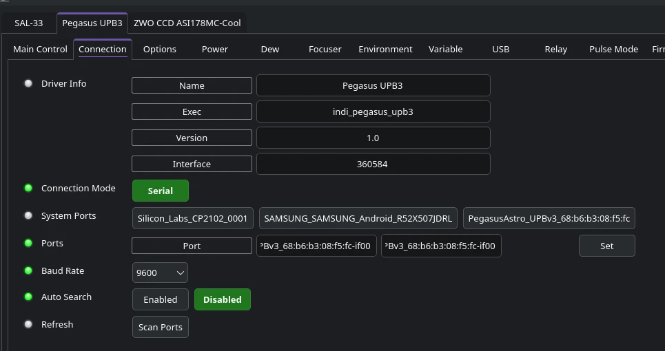
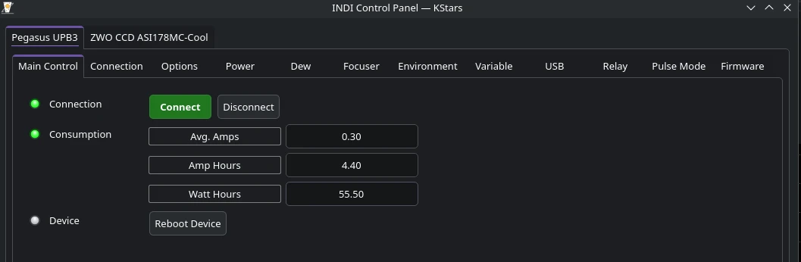
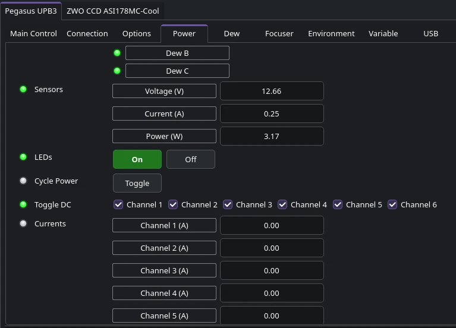
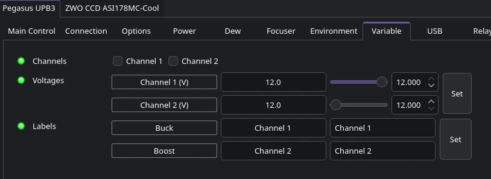
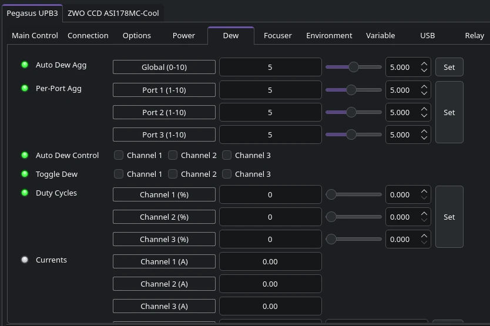
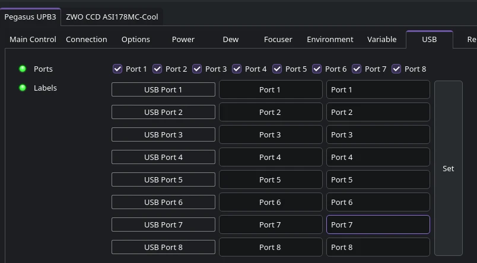
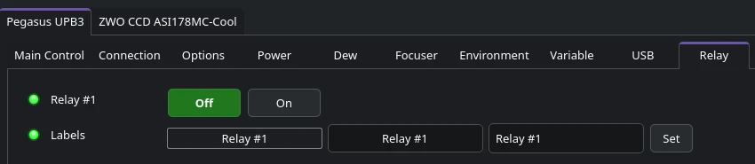
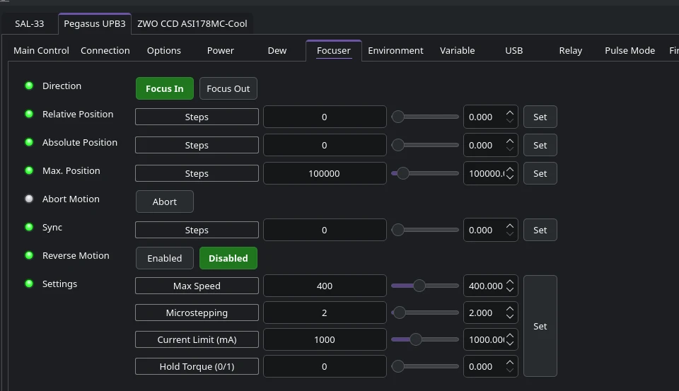
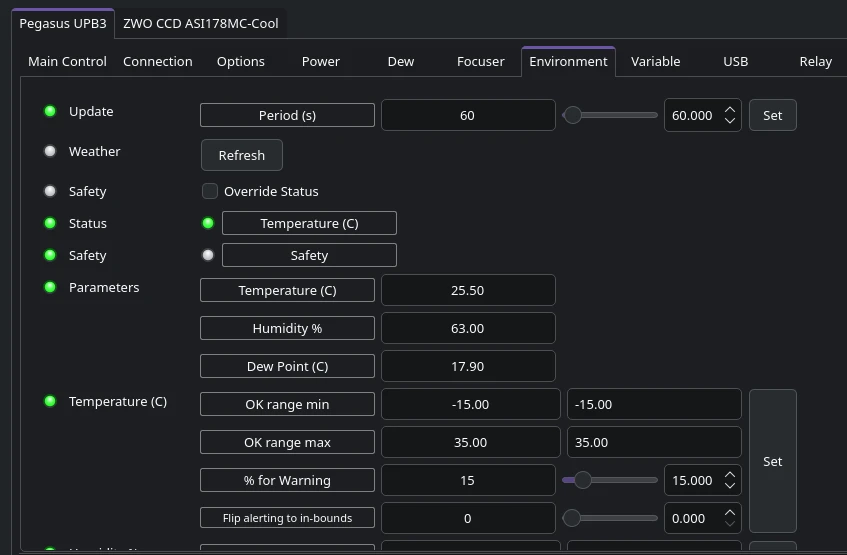

## Features

INDI Pegasus UPB V3 driver provides complete control over the Pegasus power box including:

-   6 x 12V DC Power Port Control with Overcurrent Protection
-   3 x Dew Heater Control with Auto Dew (per-port aggressiveness)
-   2 x Variable Voltage Outputs (Buck: 3-12V, Boost: 12-24V)
-   8 x USB Hub Port Control
-   Integrated Stepper Motor Focuser Control
-   1 x Relay Output
-   Power Monitoring (Voltage, Current, Power, Amp Hours, Watt Hours)
-   Environment Monitoring (Temperature, Humidity, Dew Point)

Please make sure the power box is updated to the latest firmware before using it with the INDI driver.

## Connect

Connect UPB V3 to the PC/StellarMate via the USB cable. The operating system assigns a serial port to the device (e.g. /dev/ttyUSB0). If the device cannot establish connection to the default port, it starts a process to scan the entire system for additional serial ports to connect to.

## Operation

### Main Control

To establish connection to Pegasus UPB V3, press the **Connect** button.

Once connection is established, additional tabs for the different control categories are created accordingly.

The main control provides displays for the voltage, current, and power sensors. The average consumption of current and power is also displayed along with total amp hours and watt hours consumed. You can turn on or off all the ports at once if desired. Finally, you can reboot the device.

### Power

The power tab provides all controls to manage the six 12V power ports on the UPB V3. The first property controls which ports are on or off. To change the name of the ports from the generic _Port 1_, _Port 2_...etc to more meaningful names of the actual devices (e.g. camera), edit the **Power Labels** to set the label of each port. Once set, you need to restart the driver to see the changes.

The **Power On Boot** property sets which ports are powered when the device boots up. By default, all the ports are powered.

In case of an over-current, the LEDs for each port in the **Over Current** property will turn from green to red to indicate a problem. UPB V3 monitors overcurrent protection for all 6 power ports and 3 dew heaters.

To turn on or off the small LED on the UPB box, click on the **LED** property settings.

### Variable Voltage

UPB V3 features two variable voltage outputs:

-   **Buck Converter**: Adjustable output from 3V to 12V
-   **Boost Converter**: Adjustable output from 12V to 24V

Each variable output can be enabled/disabled independently and the voltage can be adjusted to the desired level. These are particularly useful for powering devices that require specific voltages outside the standard 12V DC output.

### Dew

UPB V3 can control up to three Dew heaters using Pulse-Width-Modulation (0 to 100%). Once PWM is set, the current draw should also reflect how much current each dew heater is consuming.

To activate the Dew heating automatically based on the measured Dew point, turn it on from the **Auto Dew** property. Each dew heater port has independent auto dew control.

The **Auto Dew Aggressiveness** can be configured globally (0-10) or per-port (1-10), allowing fine-tuned control over how aggressively each dew heater responds to environmental conditions.

### USB

UPB V3 features 8 USB ports that can be controlled individually. Enable or disable each USB port as needed. This is particularly useful for power cycling USB devices or managing power consumption. Each port can be labeled with custom names for easier identification.

### Relay

UPB V3 includes a single relay output that can be used to control external devices such as lights, flat panels, or other equipment that requires simple on/off control. The relay can be toggled on or off through the driver interface.

**Pulse Mode**: The relay supports pulse mode operation, allowing you to automatically turn on the relay for a specific duration (0-60000 milliseconds). This is particularly useful for:
- Temporarily activating devices like flat panels without having to manually turn them off
- Controlling garage door or roll-off roof openers that require a brief ON pulse to trigger movement (pulse ON-OFF to go one direction, then pulse ON-OFF again to go the other direction)
- Any application requiring momentary contact closure

### Focuser

If a focuser is connected, it can be controlled directly from the focuser tab.

To move the focuser specific number of steps inward or outward, select the **Direction** and then set the **Relative Position** property.

For absolute position, enter the desired position in the **Absolute Position** property. The position must be within the maximum position as can be configured by the **Max. Position** property.

**Sync** is used to set the current focuser position to any arbitrary value.

The focuser settings include the following:

-   **Max Speed**: Maximum focuser speed (0-1000)
-   **Microstepping**: Microstepping configuration (1-32)
-   **Current Limit**: Motor current limit in mA (0-3000)
-   **Hold Torque**: Enable or disable holding torque when stopped (0/1)
-   **Direction Reverse**: Reverse the direction of focuser movement
-   **Backlash**: Backlash compensation (in steps)
-   **Backlash Enable/Disable**: Turn backlash compensation on or off

### Environment

The weather information, measured and calculated, is displayed in this tab. Three parameters are listed:

-   Temperature (C)
-   Humidity (%)
-   Dew Point (C)

The temperature parameter is considered the _Critical_ parameter and if the range is out of normal range, the overall weather status indicator shall reflect that.

Each environment variable range is controlled by the following:

1.  OK range Min: This is the **Minimum** range at which the status of the property is considered **OK** (Green LED). Anything below this would be **Alert** (Red LED)
2.  OK range Max: This is the **Maximum** range at which the status of the property is considered **OK** (Green LED). Anything above this would be **Alert** (Red LED)
3.  % for warning: At what percentage of the OK range should a warning indicator activate?

For example, if the range as illustrated above is Min: -15 and Max: 40, then the warning range is from Min: -15 + -15*0.15 = -12.75C

Similarly, the warning zone max: 40 - 40*.15 = 34C. If the temperature is 27.80 then it is within the **OK** range and not within the **Warning** zone. Once the temperature reaches 34C, the temperature indicator turns yellow to **Warning**. If it continues climbing, the state remains **Warning** until it hits and exceeds 40C in which case the state becomes **Alert**.

## Issues

There are no known bugs for this driver. If you found a bug, please report it at INDI's GitHub [Issues](https://github.com/indilib/indi/issues) page.
