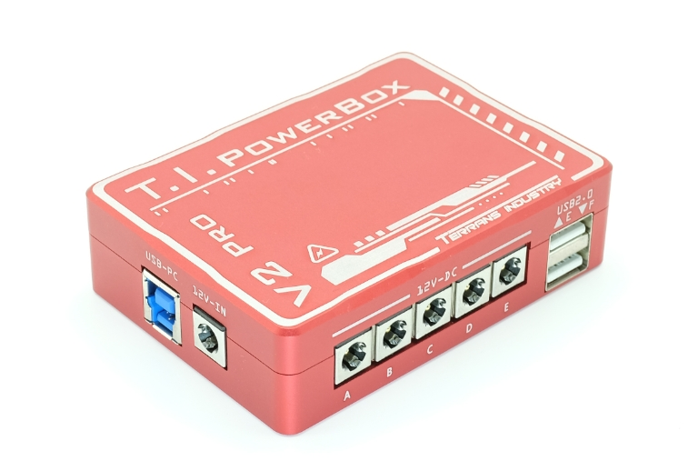
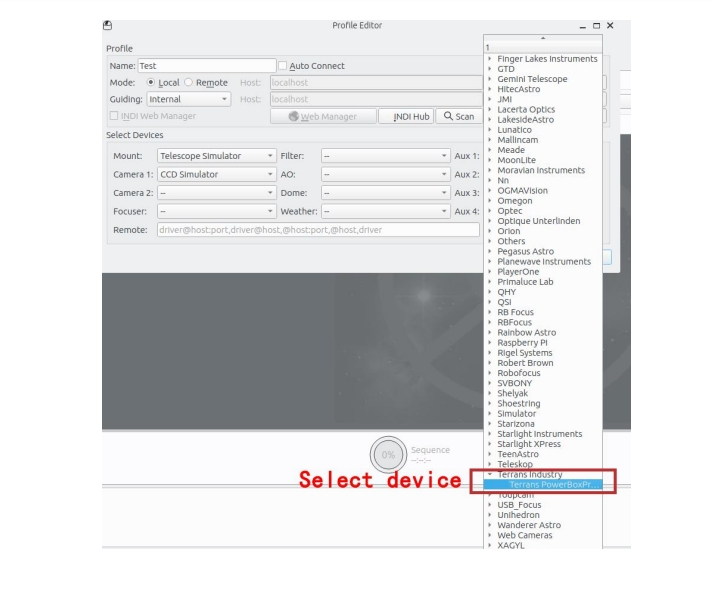
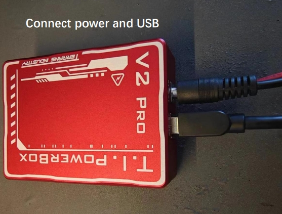
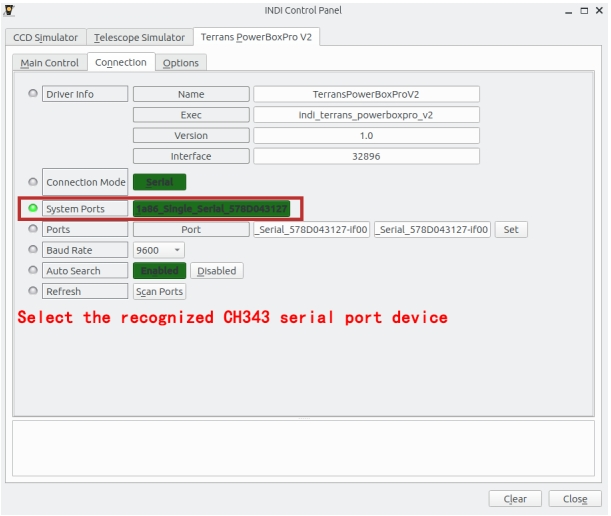
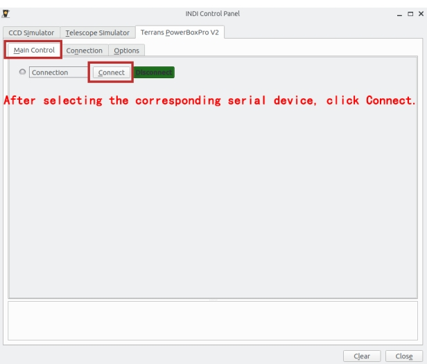
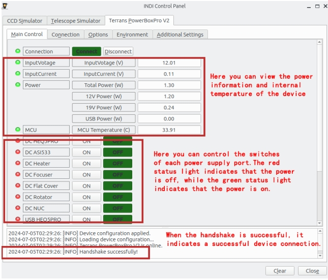
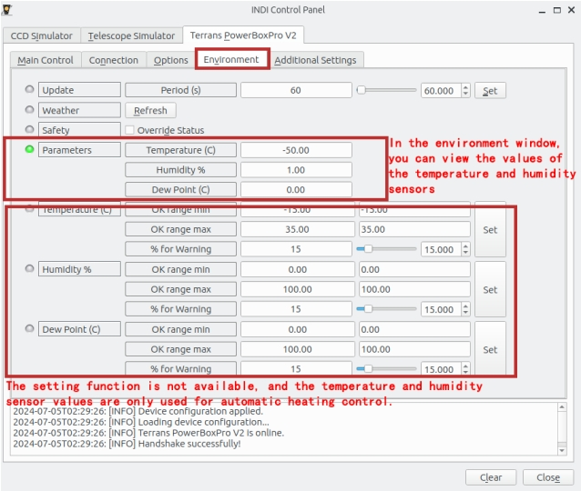
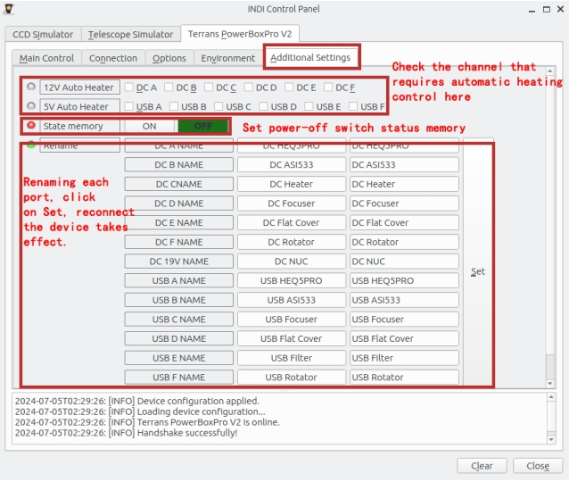

# 

Terrans PowerBoxPro V2

Terrans PowerBoxPro V2 is a comprehensive power and USB data management device used for remote astronomical photography. Equipped with four USB 3.1 ports (backward compatible with USB 2.0), two USB 2.0 ports, six 12VDC output ports, one 3V-12V DC adjustable port, one 19V NUC power supply port, and an external temperature and humidity sensor port. Supports a maximum power output of 180W, meeting the power supply needs of most users. Terrans PowerBoxPro V2 will help you clarify device wiring, bid farewell to complex wiring, and simply connect one power cord and one USB from the outside to your entire device. You can easily manage the power supply and USB communication of all devices through software. Terrans PowerBoxPro V2 uses a total of 22 imported chips from global leading semiconductor companies such as Texas Instruments (TI), STMicroelectronics (ST), and Monolithic Power Systems (MPS). Its excellent performance and protection capabilities ensure the safety and user experience of your device.

**Specifications**

Product Function List

-   Maximum output power 180W 12V/15A
-   Input voltage overvoltage/undervoltage protection
-   Six 12V DC power output ports with protection and support for independent
-   switches
-   Four USB3.1 SuperSpeed ports with protection and support for independent
-   switches and independent plug and drop controls
-   Two USB 2.0 ports with protection and support for independent switches and
-   independent plug and drop controls
-   One 3V-12V DC adjustable port
-   One 19V NUC power supply port
-   Real time monitoring of three channels voltage/current/power
-   External temperature and humidity sensors can be connected to achieve
-   automatic heating switch control
-   Switch state power-off saved, automatically restored upon repowering on
-   Internal temperature sensor, real-time acquisition of device internal temperature
-   situation
-   Hardware watchdog, automatic restart in case of crash in special circumstances
-   Equipped with 4 M4 screw fixing holes and 1/4 inch screw hole on the back
-   The motherboard is sprayed with three anti spray coatings to protect equipment
-   safety in high humidity environments and situations where condensation may
-   occur
-   Supports ASCOM, INDI platforms, supports commonly used astronomical
-   software such as NINA, KStars, etc
-   Support TerransManageDesk independent control software

**Electrical characteristics**

-   Input voltage
    -   Rated input voltage 12V
    -   When the input voltage is greater than 14V or less than 10V, the device will disable all power outputs and pop up an alarm
-   Input current
    -   Maximum input current 15A
    -   When the input voltage is 12V, the maximum output power is 1 80W
-   12V DC output
    -   Each 12V output port supports independent switches
    -   Single 12V output port can support a maximum output current of 8A
    -   Power supply output slow start, limiting large currents or voltage surges
    -   Short circuit protection. When a 12V port experiences a short circuit, the power management chip of that port will immediately cut off the power output without affecting the normal power supply of other ports.
-   USB 2.0 and USB 3.1 SuperSpeed ports
    -   Each USB port supports independent power switch
    -   Each USB port supports independent control and plugging, and USB3.1 can  
        be downgraded to USB2.0
    -   Single USB port supports a maximum output current of 2A, with overcurrent  
        protection and short circuit protection
    -   Power supply output slow start, limiting large currents or voltage surges
    -   Under voltage protection, power supply is prohibited when the voltage is  
        below 4V
    -   Reverse current blocking, USB management chip supports blocking reverse  
        current from abnormal electrical devices
    -   Overheat protection, cutting off power supply when the temperature of the  
        power supply chip exceeds 135 ℃

-   3V-12V DC adjustable output
    -   Supports adjustable DC voltage output from 3V to 12V, with an adjustable step size of 0.2V
    -   Supports up to 4A output current and overcurrent protection
    -   Overheat protection, cutting off power supply when the temperature of the  
        power supply chip exceeds 125 ℃
-   19V NUC power output
    -   Support independent power switch
    -   The output voltage is 19V, the maximum output current is 5A, and it support overcurrent protection and short circuit protection
    -   Power supply output slow start, limiting large currents or voltage surges
    -   Overheat protection, cutting off power supply when the temperature of the power supply chip exceeds 150 ℃
-   Voltage/Current/Power detection
    -   USB power/12V power/19V power three channels for real-time monitoring and display through software

Some of the INDI screenshots:

